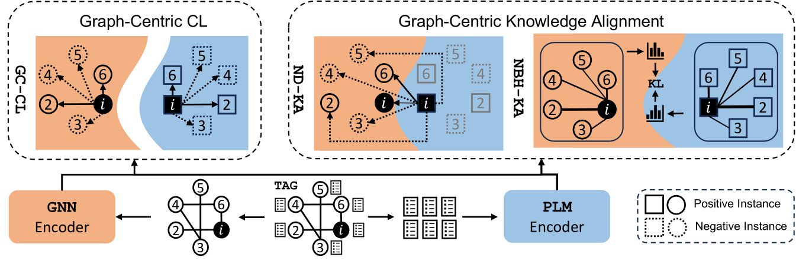

# GRENADE: Graph-Centric Language Model for Self-Supervised Representation Learning on Text-Attributed Graphs
This repository contains the code for the paper "GRENADE: Graph-Centric Language Model for Self-Supervised Representation Learning on Text-Attributed Graphs" accepted at EMNLP Findings 2023.


## Requirements
### Dependencies
Install the required packages using the following command:
```shell
pip install -r requirements.txt
```

### Dataset
The dataset is available at [here](https://drive.google.com/drive/folders/10hOJS9l9p2dnMUNX0ZqB1xDDUlGFtG8B?usp=drive_link). 
Inside each project (ogbl-citation2, ogbn-arxiv and ogbn-products) folder, there are several key files:
- {project}-ogbn.torch: The dataset file including adjacency matrix, node classification labels, and split information.
- {project}_text.csv/X.all.txt: The raw text content for each node. 
- mrr_edges.torch: The file containing the edges for link prediction task.

## Usage
### Graph-Centric Language Model for Self-Supervised Pretraining
```shell
cd scripts
sh ssl_train.sh
```


### Downstream Evaluation
The evaluation includes the following tasks:
- MLP node classification
- GraphSage node classification
- Link Prediction

```shell
cd scripts
sh eval.sh
```

## Model Checkpoint
The node embeddings checkpoint is available at [here](https://drive.google.com/drive/folders/1UbQLIbfO64cz_vgd24W4r2Y2a-V9qts5?usp=drive_link).